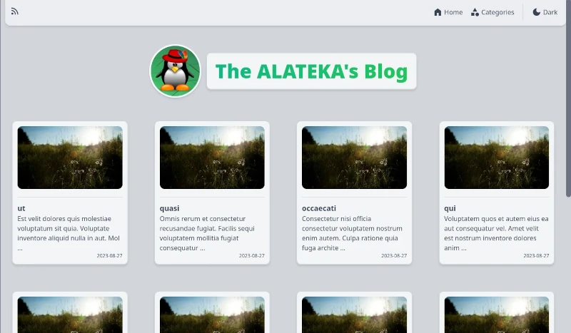
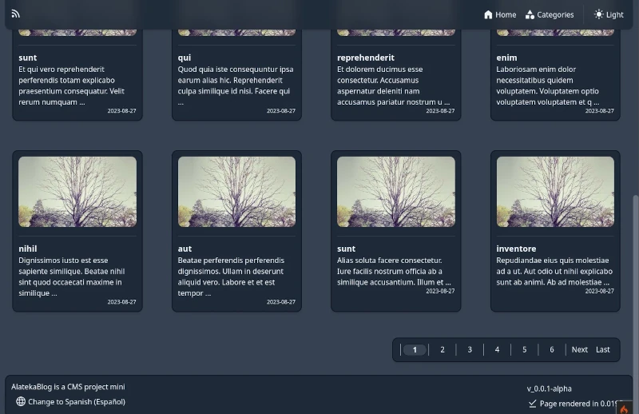

# CMS project mini
## Developed with CodeIgniter 4 & Tailwind CSS

### Images:



### Setup:

1. Create db file with ".sqlite" or ".db"

`touch app/Database/db_name.sqlite`

2. Run container

`docker-compose up -d`

NOW, INTO CONTAINER ON APP DIRECTORY

3. Install composer packages for dev

`composer install`

4. Copy & rename env file to .env

`cp env .env`

5. Edit .env file & add your custom settings
```
database.default.database = /app/myapp/app/Database/db_name.sqlite
database.default.DBDriver = SQLite3
app.baseURL = 'http://dominio.local'
```

6. Download Tailwind CLI

`curl -sLO https://github.com/tailwindlabs/tailwindcss/releases/latest/download/tailwindcss-linux-x64 && chmod u+x tailwindcss-linux-x64`

7. Run Tailwind CLI with

`./tailwindcss-linux-x64 -i app/Views/css/input.css -o public/css/app.css --watch;`

NOTE: When is production, use
" `composer install --no-dev` "
to remove dev packages and save space.
